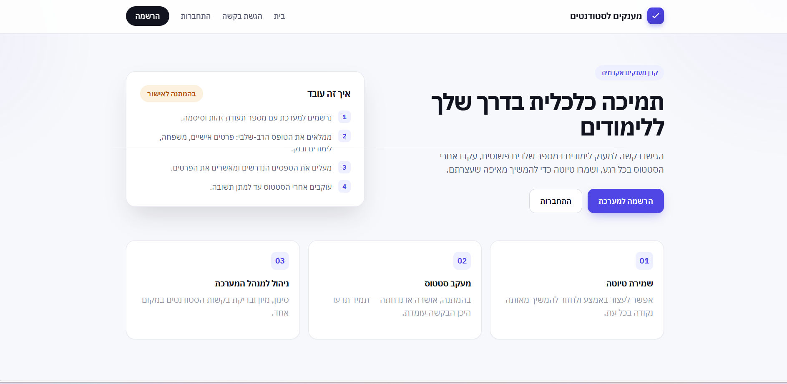
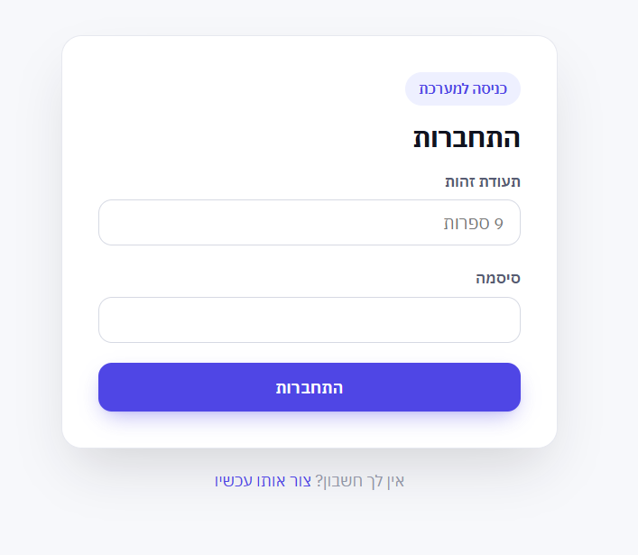
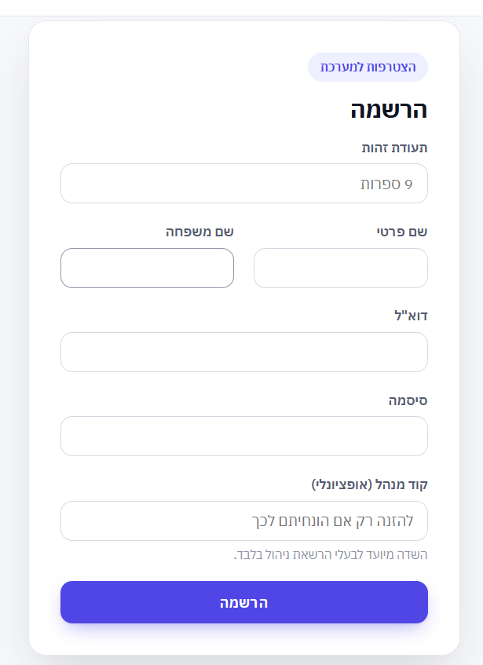
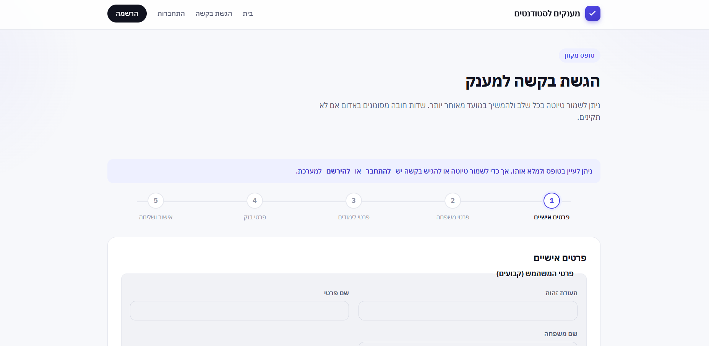
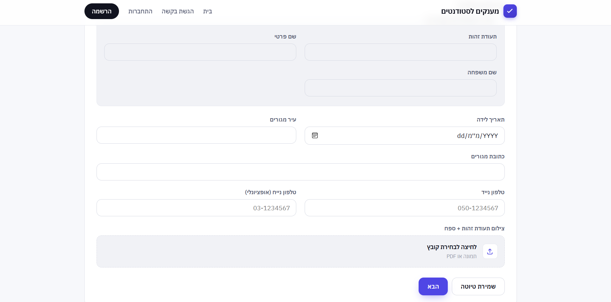
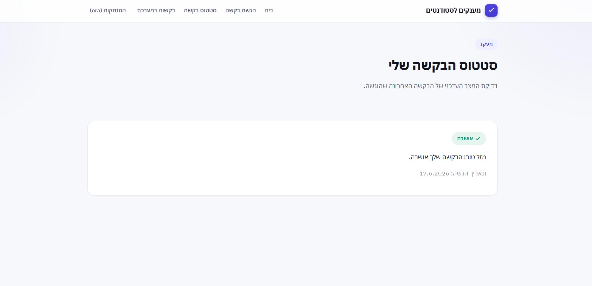
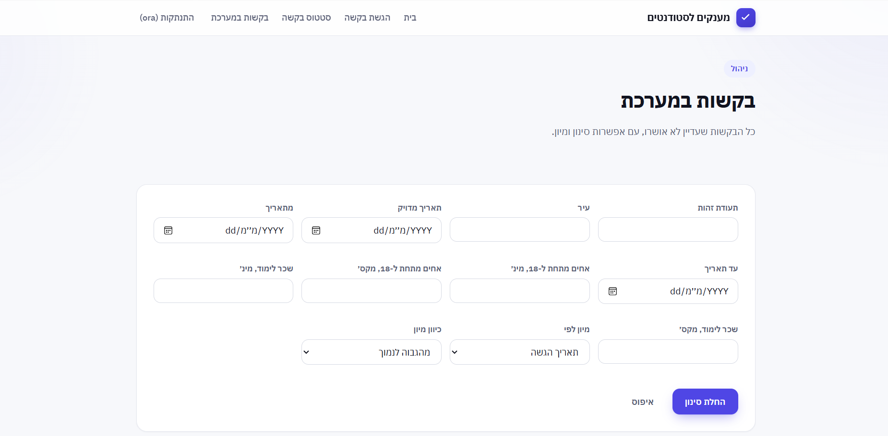

# Student Grants Management System


A Node.js, Express, and MongoDB backend built to handle the full lifecycle of student grant applications, exposing REST APIs for authentication, application processing, document storage, and admin-side review.

Applicants register, work through a multi-step grant form alongside their supporting documents, and can check where their request stands at any time. On the other side, administrators go through incoming applications, narrow them down as needed, and approve or reject each one.

A React client sits on top of the API, giving the whole flow a working, end-to-end interface.

---

## Table of Contents

- [Overview](#overview)
- [Features](#features)
- [Tech Stack](#tech-stack)
- [Backend-Focused Project](#backend-focused-project)
- [Project Structure](#project-structure)
- [Getting Started](#getting-started)
- [Environment Variables](#environment-variables)
- [Backend Architecture](#backend-architecture)
- [API Overview](#api-overview)
- [Data Model Highlights](#data-model-highlights)
- [Author](#author)
- [License](#license)

---

## Overview

The system enables students to apply for financial grants through a guided multi-step application process while allowing administrators to efficiently review and manage submitted requests.

**Student workflow**
- Register and log in securely.
- Complete a multi-step grant application (personal, family, education, and bank details).
- Upload all required supporting documents.
- Save a draft and continue later.
- Track the status of the submitted application.

**Administrator workflow**
- View all pending grant applications.
- Filter submitted applications.
- Review complete applicant information and uploaded documents.
- Approve or reject requests.

---

## Features

- 🔐 **Authentication** — registration and login using ID number (TZ) and password, with JWT-based authentication.
- 📝 **Multi-step application form** — personal details, family information, study details, bank information, and supporting document uploads, modeled as a single document with conditional validation.
- 💾 **Draft saving** — save an in-progress application and automatically restore it on return.
- 📎 **Document uploads** — student ID, parents' ID cards, enrollment certificate, and bank account confirmation, handled via Multer (image/PDF, up to 10MB).
- 📊 **Status tracking** — students can view the current status of their application (`Draft` → `Pending` → `Approved` / `Rejected`).
- 🗂️ **Admin dashboard** — filterable list of pending applications with full applicant and document review.
- ✅ **Approval workflow** — administrators can approve or reject each application.
- 🔒 **Role-based authorization** — separate permissions for students and administrators enforced through middleware.
- ✔️ **Input validation** — Mongoose-level validation with dynamic, status-aware required fields.
- ✉️ **Email delivery** — transactional email support via Nodemailer / Resend.

---

## Tech Stack

### Backend (Main Focus)
- Node.js
- Express 5
- MongoDB
- Mongoose
- JSON Web Token (JWT)
- bcrypt
- Multer
- Nodemailer / Resend
- dotenv
- CORS

### Frontend
- React 18
- Vite
- Redux Toolkit + React Redux
- React Router
- Axios

---

## Backend-Focused Project

The primary objective of this project was to design and implement a complete backend system using Node.js, Express, and MongoDB. The backend — including its architecture, API design, database modeling, and business logic — was fully developed by the author. The React client was built with the assistance of AI tools, guided and reviewed by the author, to provide a complete, working demonstration of the backend's functionality.

The backend includes:

- RESTful API design
- JWT authentication and authorization
- MongoDB data modeling with Mongoose, including nested schemas and conditional (status-based) validation
- File upload handling with Multer
- Role-based access control (student vs. admin)
- Secure password hashing with bcrypt
- Business logic for the full grant application lifecycle — draft, submission, and review

---

## Project Structure

```
grants-management-system/
├── server/                          → Backend (main focus of this project)
│   ├── Api/
│   │   ├── routers/                 → user.js, request.js
│   │   ├── controllers/             → user.js, request.js
│   │   ├── service/                 → emailService.js
│   │   ├── models/                  → user.js, request.js, constants.js
│   │   └── config/                  → mailer.js
│   ├── middleware/
│   │   ├── checkAuthorization.js    → JWT verification
│   │   ├── checkAdmine.js           → Admin-role guard
│   │   └── upload.js                → Multer disk storage + file filtering
│   ├── uploads/                     → Uploaded documents (git-ignored)
│   ├── app.js
│   ├── package.json
│   └── .env                         → Environment secrets (git-ignored)
│
├── client/                          → Frontend
│   └── src/
│       ├── api/                     → authApi.js, requestApi.js
│       ├── store/                   → Redux Toolkit store + authReducer
│       ├── components/
│       ├── pages/
│       ├── constants/
│       └── utils/
│
├── .gitignore
└── README.md
```

---

## Getting Started

### Prerequisites
- Node.js (v18 or later)
- npm
- MongoDB (local installation or MongoDB Atlas)

### Backend Setup

```bash
cd server
npm install
```

Create a `.env` file (see [Environment Variables](#environment-variables) below), then:

```bash
npm run dev     # with nodemon (auto-restart)
# or
npm start
```

The backend API runs by default on:

```
http://localhost:5555
```

### Frontend Setup

```bash
cd client
npm install
npm run dev
```

The frontend runs by default on:

```
http://localhost:5173
```

Make sure the backend is running first.

---

## Environment Variables

### `server/.env`

| Variable | Description |
|---|---|
| `MONGO_URI` | MongoDB connection string |
| `JWT_SECRET` | Secret key used to sign JWT tokens |
| `ADMIN_SECRET_CODE` | Code entered at registration to receive the `admin` role |
| `RESEND_API_KEY` | API key for sending email via Resend |
| `EMAIL_FROM` | Sender email address for outgoing notifications |

> **Important:** Never commit a real `.env` file.

---

## Backend Architecture

The server follows a layered architecture:

- **Routers** — organize REST API endpoints
- **Controllers** — handle HTTP requests and responses
- **Services** — contain business logic (e.g. email notifications)
- **Models** — define MongoDB schemas using Mongoose, with nested sub-documents and conditional validation
- **Middleware** — authentication (`checkAuth`), authorization (`checkAdmin`), and file upload handling (`upload`)

---

## API Overview

### `/user`

| Method | Endpoint | Access | Description |
|---|---|---|---|
| `POST` | `/user/register` | Public | Register a new user (student, or admin via secret code) |
| `POST` | `/user/login` | Public | Authenticate with TZ + password, receive a JWT |
| `GET` | `/user/loginByToken` | Authenticated | Re-authenticate from a stored JWT |
| `GET` | `/user/getUserProfile` | Authenticated | Get the logged-in user's profile |

### `/request`

| Method | Endpoint | Access | Description |
|---|---|---|---|
| `POST` | `/request/saveDraft` | Student | Save or update an in-progress application |
| `POST` | `/request/submitRequest` | Student | Submit the finalized application |
| `GET` | `/request/getActiveDraft` | Student | Retrieve the current draft, if any |
| `GET` | `/request/getRequestStatus` | Student | Retrieve the status of the latest submitted application |
| `GET` | `/request/getUnapprovedRequests` | Admin | List pending applications |
| `GET` | `/request/getRequestDetails/:requestId` | Admin | View full application details |
| `GET` | `/request/getRequestFile/:requestId/:fileKey` | Admin | Download an uploaded document |
| `PUT` | `/request/changeStatus/:requestId` | Admin | Approve or reject an application |

---

## Data Model Highlights

- **`User`** — TZ (Israeli ID, validated as 9 digits), name, email, hashed password, `role` (`student` | `admin`), a list of past `requests`, and an optional `draftId`.
- **`Request`** — a single document per application, composed of `personalInfo`, `familyInfo`, `educationInfo`, and `bankInfo`. Fields are optional while `status` is `"Draft"`, and become required (with dedicated validation messages) once the application is submitted.

---

## Screenshots

> A working demonstration of the client built on top of the API.

**Home**


**Login & Registration**



**Multi-step Application Form**



**Status Tracking**


**Admin Dashboard**


---

## Author

Ora Sher

## License

© 2026 Ora Sher. All rights reserved.


